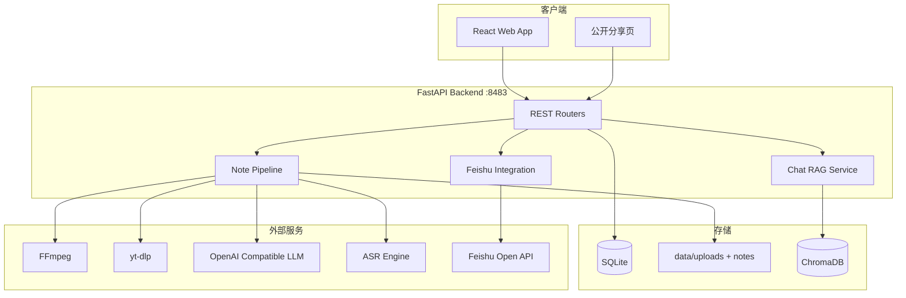
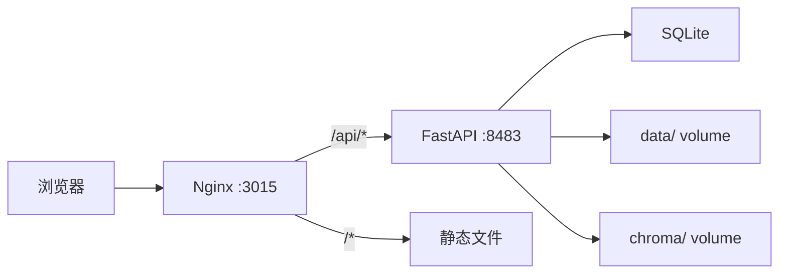

# 技术架构文档

## 1. 系统概览

Project2Note 是一个全栈 Web 应用，将视频内容转化为结构化 AI 笔记，支持飞书同步、RAG 问答与公开分享。



## 2. 技术栈

| 层级 | 技术 | 版本 |
|------|------|------|
| 后端运行时 | Python | 3.11+ |
| Web 框架 | FastAPI | 0.115+ |
| ORM | SQLAlchemy | 2.x |
| 数据库 | SQLite | 3 |
| 向量库 | ChromaDB | 0.5+ |
| 前端 | React + Vite + TypeScript | React 19 |
| UI | Tailwind CSS + shadcn/ui | - |
| 视频处理 | FFmpeg + yt-dlp | 系统/包 |
| ASR | 必剪 / 快手 / fast-whisper / Groq | 网页设置页可切换 |
| LLM | OpenAI 兼容 API | 用户配置 |
| PDF | markdown-pdf / WeasyPrint | - |
| 部署 | Docker Compose + nginx | - |

## 3. 目录结构

```
project2note/
├── docs/                     # 规划文档
├── backend/
│   ├── app/
│   │   ├── routers/          # API 路由
│   │   ├── services/           # 业务逻辑
│   │   ├── downloaders/      # 平台下载器 + bilibili_subtitle
│   │   ├── transcriber/      # ASR 适配（bcut/kuaishou/whisper/groq）
│   │   ├── gpt/              # Prompt / LLM
│   │   ├── integrations/     # 飞书 / B站搜索
│   │   ├── db/               # 数据库
│   │   ├── models/           # Pydantic 模型
│   │   ├── exceptions/       # 异常处理
│   │   └── utils/            # 工具函数（含 crypto.py AES 加解密）
│   ├── main.py
│   └── requirements.txt
├── frontend/
│   └── src/
│       ├── pages/
│       ├── components/
│       ├── services/
│       └── store/
├── data/                     # 运行时数据（gitignore）
├── docker-compose.yml
└── .env.example
```

## 4. 核心数据流

### 4.1 笔记生成流水线

```
POST /api/tasks
  → task_serial_executor.enqueue
  → [bilibili only] fetch_bilibili_subtitles (B 站 player API 直拉字幕)
      ├─ 成功 → 跳过 ASR，progress = transcribing_skipped
      └─ 失败 → 继续下方 ASR 路径
  → downloader.download (bilibili/douyin/local，B 站需 Cookie)
  → [无字幕时] ffmpeg.extract_audio
  → [无字幕时] transcriber.transcribe (引擎由 transcriber_config 决定)
  → transcript_cleaner.clean
  → note_generator.generate (LLM chunked)
  → bilibili_search.enrich_recommendations
  → persist note + transcript to DB
  → vector_store.index (for chat)
  → status = COMPLETED
```

**B 站字幕优先**：`bilibili_subtitle.fetch_bilibili_subtitles` 调用 `/x/web-interface/view` + `/x/player/wbi/v2` 获取字幕列表，按「人工 zh > AI zh > 任意 zh > 其他」选轨，再拉取 `subtitle_url` JSON。需 Cookie（尤其 AI 字幕依赖 `SESSDATA`）；失败时静默降级为 ASR，不中断任务。

**转写引擎**（`data/config/transcriber.json`，亦可通过设置页修改）：

| 引擎 | 类型 | 说明 |
|------|------|------|
| bcut | 在线 | 必剪，国内推荐，免 Key |
| kuaishou | 在线 | 快手接口，国内可用 |
| fast-whisper | 本地 | faster-whisper，需额外安装 |
| groq | 在线 API | Groq 托管 Whisper，需 Key |

### 4.2 任务状态机

```
PENDING → PROCESSING → COMPLETED
                    ↘ FAILED (含 error_message，不自动重试)
```

## 5. 数据库模型

| 表 | 用途 |
|----|------|
| tasks | 任务主表（状态、平台、风格、错误信息） |
| notes | 笔记内容（raw/edited markdown、structured JSON） |
| transcripts | 逐字稿 segments |
| chat_messages | 问答历史 |
| provider_configs | LLM 供应商配置 |
| platform_cookies | 平台 Cookie |
| feishu_tokens | 飞书 OAuth token |
| feishu_sync_records | 同步记录 |
| share_links | 公开分享 token |
| recommendations | B站延伸推荐缓存 |

## 6. 模块职责

| 模块 | 职责 |
|------|------|
| downloaders | 抽象 BaseDownloader，平台实现注入 Cookie |
| bilibili_subtitle | B 站官方 API 直拉字幕，有则跳过 ASR |
| transcriber | TranscriberFactory，按 transcriber_config 选择引擎 |
| transcriber_config_manager | 转写引擎持久化（`data/config/transcriber.json`） |
| transcript_cleaner | 语气词过滤 + 复读去重 |
| note_generator | 分块 LLM 调用 + 四板块 Prompt |
| vector_store | ChromaDB 按 task_id 隔离 |
| chat_service | RAG + Tool Calling + 风格注入 |
| feishu_oauth | OAuth2 授权与 token 刷新 |
| feishu_sync | Docx 创建 + Bitable 记录 |
| bilibili_search | 关键词搜索相关视频 |
| export_service | MD/PDF 导出 |

## 7. 部署拓扑



### Docker Compose 服务

- `backend`: Python FastAPI，挂载 `data/`、`chroma/`
- `frontend`: nginx 托管 Vite build + API 反代
- 环境变量见 `.env.example`

## 8. 安全与隐私

- API Key 落库前 Fernet（AES-128-CBC + HMAC-SHA256）加密，密钥由 `AUTH_SECRET_KEY` 派生
- Cookie / 加密 Key 存 SQLite，不提交 git
- 分享链接 UUID 不可猜测
- CORS 限制 localhost + 配置域名

## 9. 扩展点（二/三期）

- Downloader 插件化接口 → 更多平台
- `collections` / `task_collections` 多对多
- `style_templates` 自定义 Prompt 持久化
- tus 分片上传中间件
