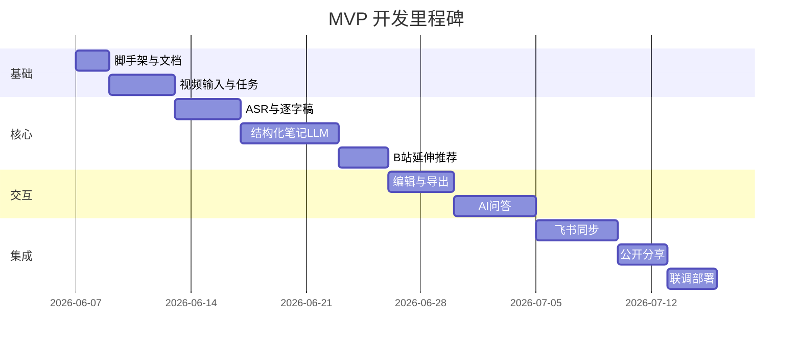

# 产品路线图

## 总览

| 阶段 | 范围 | 预估工期（单人全职） | 状态 |
|------|------|---------------------|------|
| MVP 一期 | PRD 5.1 全部必做 | 4–6 周 | 进行中 |
| 二期 | 优化与扩展 | 2–3 周 | 待启动 |
| 三期 | 选做功能 | 2–4 周 | 待评估 |

---

## MVP 一期里程碑

### 阶段明细

| 阶段 | 交付物 | 天数 |
|------|--------|------|
| 0 | 脚手架、DB、Docker、文档 | 1–2 |
| 1 | 上传/链接/Cookie/异步任务 | 3–4 |
| 2 | ASR、清洗、逐字稿 Tab | 3–4 |
| 3 | 六板块笔记、双风格、详略模式 | 5–6 |
| 4 | 术语、B站推荐、关键词刷新 | 2–3 |
| 5 | 编辑、MD/PDF 导出 | 3–4 |
| 6 | RAG 问答、风格同步 | 4–5 |
| 7 | 飞书 OAuth、云文档、多维表格 | 4–5 |
| 8 | 公开分享链接 | 2–3 |
| 9 | 联调、错误处理、Docker | 2–3 |

---

## 二期迭代（MVP 后）

| 功能 | 优先级 | 说明 |
|------|--------|------|
| 大文件分片上传 | P1 | tus 协议 + 进度条 |
| 合集分类 | P1 | 多对多归类学习资料 |
| 自定义风格模板 | P2 | 保存/复用 Prompt |
| 更多平台 | P2 | YouTube、快手等插件化 |
| 自定义高亮颜色 | P2 | 编辑器 + 导出 CSS |

**预估：** 2–3 周

---

## 三期选做扩展

| 功能 | 优先级 | 说明 |
|------|--------|------|
| 可交互思维导图 | P3 | markmap / d3 |
| PPT 自动生成 | P3 | python-pptx / Marp |
| 问答插入笔记 | P3 | 一键插入对应章节 |

**预估：** 2–4 周（按需启动）

---

## 风险缓冲

| 风险 | 缓冲 | 缓解 |
|------|------|------|
| 飞书 Docx 样式 | +3 天 | 先文本+标题，后迭代高亮 |
| B站搜索反爬 | +2 天 | 降级为仅关键词 |
| 长视频 LLM 成本 | - | 分块 + 双版本缓存 |
| ASR 环境配置 | +1 天 | 默认在线 Groq |

---

## 成功标准（MVP 完成定义）

1. 本地/Docker 一键启动
2. B站、抖音、本地视频均可生成完整笔记
3. 六板块 + 双风格 + 逐字稿 + 问答 + 导出 + 飞书 + 分享全部可用
4. MVP_CHECKLIST 冒烟测试 10 项通过
